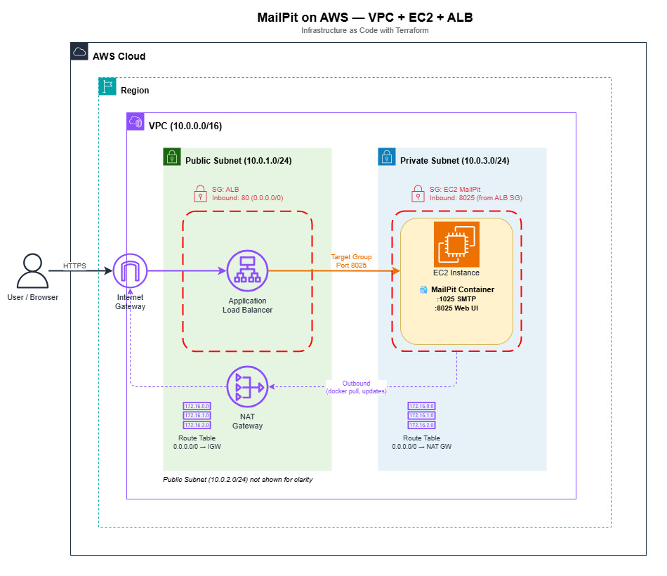

# Terraform-Mail-Server-AWS-Phase1
This is a small, learning-focused Terraform project that builds a test mail server stack on AWS.

## Overview
It provisions a VPC with public and private subnets, an Application Load Balancer, and an EC2 instance running Mailpit. The setup is intentionally minimal and modular to help me practice Terraform, VPC, and EC2 fundamentals.

## Architecture


**Diagram summary:** VPC with public/private subnets, an ALB in public subnets, and an EC2 instance in a private subnet. Security groups restrict traffic between the ALB and EC2.

## Project Structure
```
Project Structure
├── main.tf (root module)
│   └── Resources: 1
│       - null_resource (account check)
│
├── modules/
│   ├── vpc/
│   │   └── Resources: 11
│   │       - VPC
│   │       - 3 Subnets (2 public, 1 private)
│   │       - Internet Gateway
│   │       - NAT Gateway + Elastic IP
│   │       - 2 Route Tables (public, private)
│   │       - 2 Route Table Associations
│   │
│   ├── security/
│   │   └── Resources: 6
│   │       - 2 Security Groups (ALB, EC2)
│   │       - 2 Ingress Rules
│   │       - 2 Egress Rules
│   │
│   ├── ec2/
│   │   └── Resources: 4
│   │       - EC2 Instance
│   │       - IAM Role (SSM)
│   │       - IAM Role Policy Attachment
│   │       - IAM Instance Profile
│   │
│   └── alb/
│       └── Resources: 4
│           - Application Load Balancer
│           - Target Group
│           - Listener
│           - Target Group Attachment
│
Total Resources: 26
```

## Prerequisites
- Terraform CLI installed (tested with recent 1.x versions).
- AWS credentials configured locally (this repo uses the `sandbox` profile).
- Permissions to create VPC, subnets, security groups, ALB, EC2, and related networking resources.

### AWS account setup
This project uses a dedicated AWS CLI profile named `sandbox` to avoid deploying to your default account. Configure it with your access key and secret access key:

```
aws configure set aws_access_key_id <YOUR_KEY> --profile sandbox
aws configure set aws_secret_access_key <YOUR_SECRET> --profile sandbox
```

**Safety check:** the Terraform configuration in [main.tf](main.tf) includes `null_resource.account_check`, which validates the expected AWS account ID before apply. This helps avoid deploying to the wrong account.

## Usage
1. Initialize Terraform:
	- `terraform init`
2. Review the plan:
	- `terraform plan`
3. Apply the changes:
	- `terraform apply`
4. Clean up when done:
	- `terraform destroy`

## Inputs
| Name | Type | Default | Description |
| --- | --- | --- | --- |
| `region` | string | `us-east-1` | The AWS region where resources will be deployed. |

## Outputs
| Name | Description |
| --- | --- |
| `alb_url` | URL to access the mail server UI via the ALB. |

## Future Improvements (Next Phases)
- **High availability with ASG across multiple AZs**
	- Goal: keep at least 1 healthy instance at all times and support rolling updates with zero downtime.
	- Terraform scope: Auto Scaling Group, launch template, ALB target group integration, and health checks.
	- Impact: improved resilience and deployment safety (with some additional baseline cost).

- **Authentication in front of ALB using Amazon Cognito User Pools**
	- Goal: require login before accessing the Mailpit UI and support multi-tenant access patterns.
	- Terraform scope: AWS Cognito, Cognito User Pools.
	- Impact: enables access control.

- **Backend SMTP email generator service**
	- Goal: create a serivce to populate emails through SMTP instead of running scripts manually via the SSM agent.
	- Terraform scope: backend worker/lambda function, IAM permissions, trigger setup.
	- Impact: additional sevices to mangage (more realistic scenario).

- **Pre-baked AMI with Docker/Mailpit dependencies**
	- Goal: speed up instance boot and remove runtime dependency installation.
	- Terraform scope: image build pipeline (for a golden AMI), removing the NAT gateway.
	- Impact: faster startup, more predictable deployments, and NAT gateway cost reduction.
